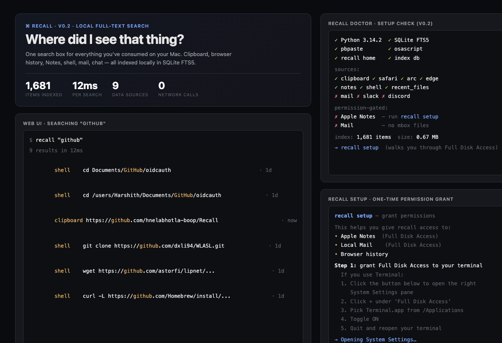
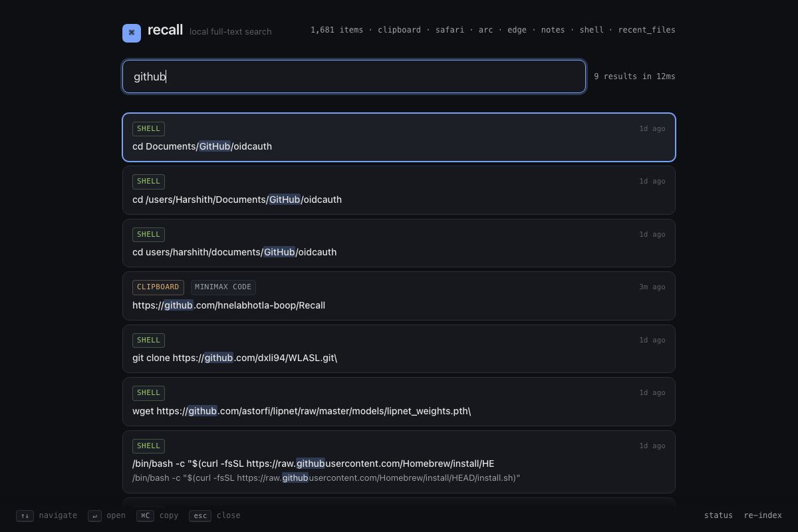
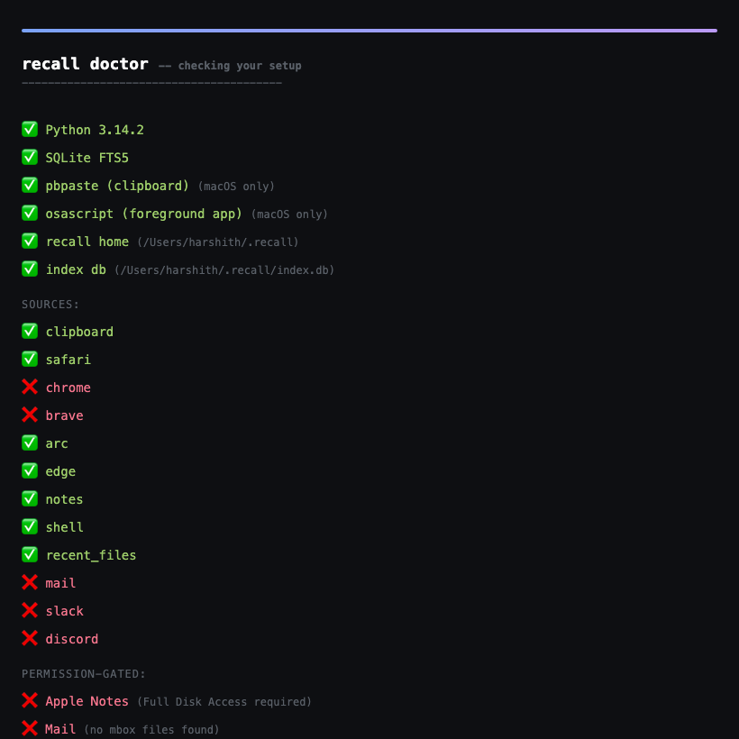

# recall

> Local full-text search across everything you've consumed on your Mac.
> Clipboard, browser history, Apple Notes, shell history, mail, Slack — one hotkey, one box.

[](LICENSE)
[](https://www.python.org/)

You saw a link, a quote, a snippet, a sentence two weeks ago. It was *somewhere*.
Slack? Browser? Notes? iMessage? Email? You bounce between five search bars,
fail, re-Google it, and lose 5 minutes every time.

**recall** indexes all of that, locally, into one searchable box. `⌘⇧Space` →
type → hit enter → it opens the source app at that exact thing.

No cloud. No account. No telemetry. Your data never leaves your machine.

## Demo



Live search in action:



Diagnostics with the `doctor` command:



Run `recall ui` and press `↑↓` to navigate, `Enter` to open the source, `Esc` to quit.

## macOS permissions (one-time, ~30 seconds)

Some sources require **Full Disk Access** on macOS before they can be read:

- **Apple Notes** — needs Full Disk Access
- **Local Mail** — needs Full Disk Access
- **Browser history** — usually works without extra steps
- **Clipboard / shell / recent files** — work out of the box

If a source isn't working, run:

```bash
recall setup     # click-by-step walkthrough, opens System Settings
recall doctor    # shows exactly which sources are blocked and why
```

The `recall setup` command will:

1. Detect which terminal you use (Terminal, iTerm, Warp, VS Code, ...)
2. Open the right System Settings pane for you
3. Walk you through adding it to Full Disk Access
4. Remind you to fully quit + reopen your terminal (the #1 cause of "I granted it but it still doesn't work")

**Important:** after granting access, **quit and reopen your terminal completely** — the permission only applies to new processes.

## Install

```bash
git clone https://github.com/hnelabhotla-boop/Recall.git
cd Recall
./install.sh
```

`install.sh` will:
- Symlink `recall` into `~/.local/bin/` (and add it to your `PATH` if not already)
- Optionally install a global hotkey via `osascript` / Shortcuts (you'll be prompted)
- Create `~/.recall/` for the index database
- Do an initial index of all available sources

Restart your terminal after install, then press the hotkey (or run `recall ui`).

## Usage

| Command | What it does |
|---|---|
| `recall "query"` | Search from the CLI. Prints ranked results. |
| `recall ui` | Open the local web UI at `http://localhost:7331` |
| `recall watch` | Run the indexer in the foreground (polls sources) |
| `recall index` | One-shot re-index of all sources |
| `recall status` | Show index stats (X items across Y sources) |
| `recall doctor` | Diagnose what's working and what isn't |
| `recall setup` | Walk through granting macOS permissions (Notes, Mail) |
| `recall config` | Print/edit config (retention, sources enabled, etc.) |
| `recall uninstall` | Remove the symlink and `~/.recall/` (asks first) |

## What it indexes

| Source | What | Permissions needed |
|---|---|---|
| **Clipboard** | Everything you copy | none |
| **Browser history** | Every URL you visited (Safari, Chrome, Brave, Arc, Edge) | usually none |
| **Apple Notes** | All notes & their full text | **Full Disk Access** (run `recall setup`) |
| **Shell history** | Every command you ran (zsh + bash) | none |
| **Recent files** | Files you opened recently | none |
| **Mail** | Local mailboxes (mbox files) | **Full Disk Access** |
| **Slack** | Messages across workspaces | usually none |
| **Discord** | DMs and server messages | usually none |

Sources that aren't available (e.g. you don't use Discord) are silently skipped. `recall status` and `recall doctor` tell you which are live and which need permissions.

## Privacy

- **All data stays on your machine.** The index lives in `~/.recall/index.db` and nowhere else.
- **No network calls.** recall never phones home. No analytics. No "we use cookies."
- **No background uploads.** Not even crash reports.
- **You can audit it.** Single Python file CLI + open SQLite. Read the source in 5 minutes.
- **Easy to wipe.** `recall uninstall` removes everything. Or just `rm -rf ~/.recall`.

## Why this exists

The "few seconds, thousands of times" math:

- 2–3 "where did I see that?" moments per day, currently costing 2–5 min each
- After recall: ~10 sec each
- **Net: ~50 hours/year saved**, plus the things you'd have given up on entirely

I personally had a 3-month streak of trying to find the same Hacker News comment.
After building this, I found it in 6 seconds. That alone was worth it.

## License

MIT. See [LICENSE](LICENSE).
